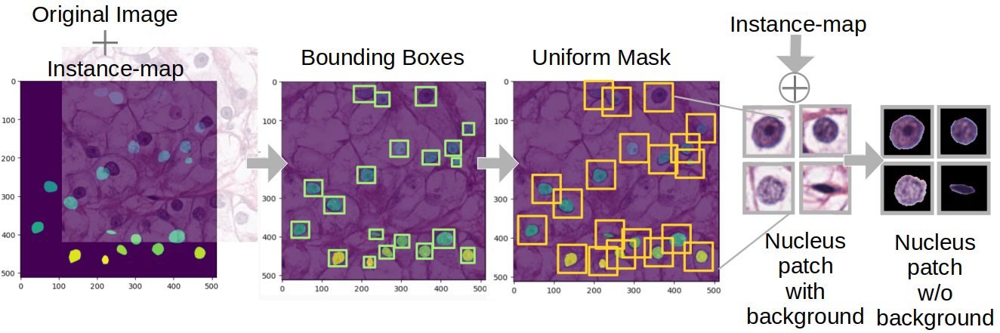
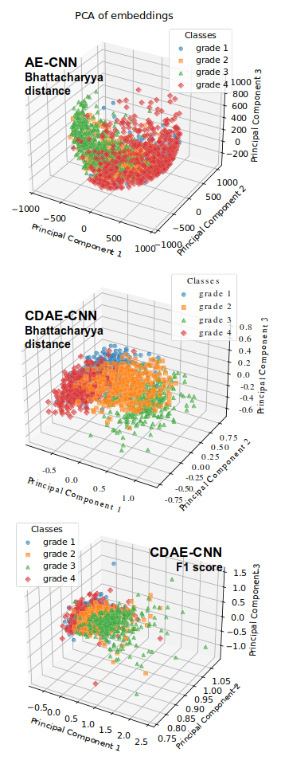
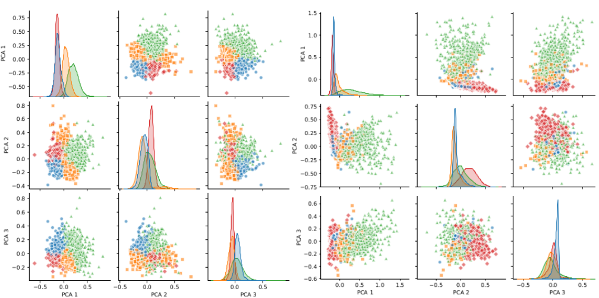

# Comparative Analysis of Unsupervised and Supervised Autoencoders for Nuclei Classification in Clear Cell Renal Cell Carcinoma Images

Reference implementation of the autoencoder models used to grade individual cell nuclei in clear cell renal cell carcinoma (ccRCC) histopathology.

**Paper:** [DOI](https://doi.org/10.1109/isbi60581.2025.10981207)

## Problem

Grading ccRCC nuclei under the WHO/ISUP system means deciding, for each nucleus, whether its nucleolus is visible and how prominent it is, which places it in grade 1, 2 or 3. The decision is made by eye at 400x magnification and it is not a clean partition: grades 2 and 3 differ by morphological margins narrow enough that pathologists disagree with each other on the boundary cases. That matters clinically because the highest grade present usually sets the grade of the whole slide, so the rare aggressive nuclei carry most of the diagnostic weight while being the hardest to identify and the least represented in any annotated dataset. This repository asks how much of that structure an autoencoder can recover from the nuclei themselves, and where unsupervised representation learning stops being enough.

## Results

Bhattacharyya distance of the best model of each type, after architecture search and fine tuning. Higher means better separated classes in the latent space.

| Model | AE | CAE | DAE | CDAE |
|-------|-------|-------|-------|-------|
| MLP | 14.75 | 24.50 | 17.43 | 34.62 |
| CNN | 16.33 | 19.21 | 25.93 | 47.23 |

Effect of the search objective on the CDAE-CNN model. The same architecture search was run twice, once maximising latent separation and once maximising F1.

| Metric | Bhattacharyya optimised | F1 optimised |
|--------|--------------------------|--------------|
| Overall precision | 0.6104 | 0.6985 |
| Overall recall | 0.6111 | 0.7008 |
| Overall F1 | 0.6113 | 0.6994 |
| Grade 1 F1 | 0.5571 | 0.6373 |
| Grade 2 F1 | 0.4469 | 0.5481 |
| Grade 3 F1 | 0.6890 | 0.7821 |
| Non-tumorous F1 | 0.7520 | 0.8300 |
| Bhattacharyya distance | 47.23 | 36.90 |

Comparison against CHR-Network, which was trained on the same source dataset.

| Metric | CHR-Network | CDAE (this work) |
|--------|-------------|------------------|
| Grade 1 F1 | 0.8243 | 0.6373 |
| Grade 2 F1 | 0.4793 | 0.5481 |
| Grade 3 F1 | 0.5228 | 0.7821 |
| Non-tumorous F1 | 0.7057 | 0.8300 |
| Balanced accuracy | 0.6405 | 0.7008 |

CHR-Network was trained on the unbalanced dataset, with 45108, 6406, 2779 and 16652 samples for grades 1 to 3 and non-tumorous cells. Grade 1 dominance inflates its overall accuracy, which is why balanced accuracy is the row to compare on.

## Findings

Reconstruction alone does not recover the grade structure. The plain autoencoder produces the weakest latent separation of any configuration tested, in both the MLP and the CNN form. This is the expected result rather than a failure of tuning: nothing in a reconstruction objective asks the embedding to distinguish a grade 2 nucleus from a grade 3 one, and the pixel-level variance that dominates the reconstruction error is driven by nucleus size and stain intensity, not by nucleolar prominence. Adding structure to the unsupervised objective helps but does not close the gap. The contractive penalty improves separation, and in the MLP case substantially, but it also introduces a failure mode: with the penalty weighted too heavily the latent space collapses, so the weight has to be searched rather than fixed. The discriminative variant improves the CNN more than the contractive one does, which is consistent with its loss acting directly on class geometry rather than on sensitivity to input perturbation.

The decisive change is supervision, not architecture. Adding a classifier branch to the latent space raises the CNN Bhattacharyya distance from 25.93 to 47.23, a larger jump than any change of encoder type produced. The reason is visible in the problem itself. Grade boundaries in ccRCC are partly conventional, set by expert agreement about how prominent a nucleolus has to be, and there is no reason an unsupervised objective should place its decision surface where the WHO convention places it. Labels are the only source of that information, and once the model has access to them the latent space reorganises around the boundaries that actually matter.

Optimising for latent separation and optimising for classification are not the same objective. The model with the highest Bhattacharyya distance is not the best classifier. Re-running the architecture search against F1 lowers the Bhattacharyya distance from 47.23 to 36.90 while improving every classification metric, per class and overall. A well separated latent space is a proxy for good classification, and this result puts a number on how far the proxy diverges from the target. For a search that costs hundreds of trials, that choice of objective is not a detail.

The comparison against CHR-Network shows where the approach pays off. The CDAE loses on grade 1 and wins on everything else, including a grade 3 F1 of 0.7821 against 0.5228. The direction of that trade is favourable for this task, because grade 1 is both the most common class and the least consequential for the final slide grade, while grade 3 is rare and drives the treatment decision. It is worth stating the handicaps under which that result was obtained: the CDAE was trained on a balanced subset, so it saw far fewer nuclei in total, and background removal discards the spatial context of neighbouring nuclei that CHR-Network can use. The gain on the difficult grades comes despite both, not because of them.

## Dataset

H&E stained ccRCC images from TCGA, annotated as described in the CHR-Network work. The source data are 512x512 crops from whole slide images, with annotations in `.mat` files containing an instance map and a class map. The instance map assigns a unique identifier to each nucleus, which is what makes it possible to separate nuclei inside a cluster. The class map carries the grade label.

Patch preparation, in order:

1. Load each image with its `.mat` annotation.
2. Mask each nucleus separately using the instance map.
3. Compute bounding boxes across all nuclei and take the largest uniform square, so every patch has the same size.
4. Centre each nucleus in its uniform mask and save the patch, named after the source image plus the instance index, so patches can be mapped back to their original position in the slide.
5. Read each nucleus grade from the class map into a CSV annotation table.
6. Build a binary nucleus mask from the instance map, dilated by 3 pixels.
7. Apply the mask per colour channel to remove the background and suppress adjacent nuclei.

Final patch size is 3 x 79 x 79. The full set contains 6941 patches: 3782 grade 1, 752 grade 2, 850 grade 3, 1557 non-tumorous. Training uses a balanced subset. Augmentation is flipping. Z-score normalisation uses channel statistics computed on the training split only.

Removing the background is a deliberate deviation from most of the literature, which keeps it. The argument for removing it is that it forces the network onto the nucleus interior, where the grading criterion actually lives. The cost is that the model loses all information about nuclear distribution and neighbourhood, which is part of what a pathologist uses.

Neither the images nor the annotations are redistributed here.

## Method

Four autoencoder types, each built in an MLP and a CNN form.

**AE.** Reconstruction only, mean squared error.

**CAE.** Adds the squared Frobenius norm of the encoder Jacobian, which penalises latent sensitivity to small input changes. The weight is searched, since too large a value collapses the latent space.

**DAE.** Adds a term acting directly on class geometry in the latent space.

**CDAE.** Adds a classification branch on top of the latent vector. The classification loss is a weighted negative log likelihood, combined with the reconstruction and latent-structure terms.

Latent separability is measured with Bhattacharyya distance. Each latent dimension is min-max scaled, per class histograms are built with bin count set to the square root of the class sample count, each histogram is normalised to sum to one so it approximates a density, pairwise distances are computed into a symmetric matrix, and the mean of the upper triangle excluding the diagonal is the score. Davies-Bouldin, Calinski-Harabasz, Silhouette and MANOVA were considered first. They were set aside because treating cohesion and dispersion as independent quantities misreads latent spaces that are tightly clustered but poorly separated, and because MANOVA assumes normality that latent spaces do not provide. KL divergence was rejected for asymmetry.

Architecture and hyperparameters were searched with Optuna, with trial history in a SQL database and a funnel constraint forcing encoder widths to decrease monotonically. Search ranges: latent dimension 2 to 25, layer count 3 to 12, MLP width 8 to 256, CNN channels 1 to 32, CNN kernel size 3 to 7 in steps of 2, CNN dense layer 4 to 32, learning rate 1e-3 to 1e-2 on a log scale, contractive weight 0.05 to 5, discriminative weight 0.5 to 5, classifier dense layer 4 to 32, classification weight 1 to 10. Trials trained on a proxy set of 512 images per class for 30 epochs, and the winning configuration was then retrained on the full training set.

The selected model is the F1-optimised CDAE-CNN. Its encoder is nine convolutional blocks of Conv2d, ReLU and BatchNorm2d, kernel size 7 and stride 1 throughout, with channel counts 26, 23, 22, 17, 16, 15, 4, 3, 2, then flatten, a dense layer of 7 with ReLU, then a latent layer of dimension 10. The decoder mirrors this with transposed convolutions. The classification branch is a dense layer of 18 with ReLU, then 4 outputs with LogSoftmax.

## What this repository contains

The code here is the model and training layer: the four autoencoder variants, the MLP and CNN builders that construct encoder and decoder pairs from a layer specification, the data loading, and the training entry points.

Two components described above are not in this repository. The Optuna search driver is not included, so the training scripts under `scripts/` sweep architectures with explicit nested loops over hand-listed configurations rather than by sampling the search space. The Bhattacharyya distance implementation is also not included, and the only latent-space metric present is the Davies-Bouldin score in `clustering_eval.py`, which is one of the metrics the paper reports having set aside. These files are being looked for and will be added if they are recovered.

Two implementations differ from their description in the paper, and the code is the record of what was run at this point in the project rather than of the final formulation. `autoencoder/discriminative.py` uses a triplet margin loss over batch-mean positives and negatives, not the centroid formulation `ld = db + dw + |db - dw|`. `autoencoder/classifier.py` implements the within-class centroid term only, without the between-class dispersion term, and its classification head goes straight from the latent vector to four outputs without the intermediate dense layer of the selected model.

`legacy/keras_prototype/` is an earlier TensorFlow and Keras version of the same idea, superseded by the PyTorch code. It is kept for provenance and shares no code with the rest of the repository.

## Figures

Fig. 1. Process of preparing nuclei patches for the AE. From left to
right: nuclei are segmented using the instance map, enclosed within
uniform bounding boxes, cropped, and then background is removed
by reapplying the instance map to isolate nuclei within the patches.



Fig. 2. Visualization of the first three PCA components for training
results of the highest-performing latent space embeddings. (top) AE
optimized for Bhattacharyya distance. (middle) CDAE-CNN optimized for
Bhattacharyya distance. (bottom) CDAE-CNN optimized for F1 score. Note
that Grade 4 refers to Non-Tumorous in this context.



Fig. 3. Pair plots of the first PCA elements for the highest performance
AE latent space embeddings. (a) The train results of CDAE-CNN for the
highest performance model optimized for Bhattacharyya distance. (b) The
train results of CDAE-CNN for the highest performance model optimized
for F1-score.



Conference poster: 

## Repository layout

```
autoencoder/          model classes, all subclassing the shared base
  autoencoder.py      base class: training loop, checkpointing, latent extraction, plots
  plain.py            AE, reconstruction only
  contractive.py      CAE, Jacobian penalty
  discriminative.py   DAE, latent class-structure term
  classifier.py       CDAE, classification branch and centroid loss
maker/                encoder and decoder builders
  handlers.py         activation lookup and layer-spec expansion
  mlp.py              dense encoder and mirrored decoder
  cnn.py              convolutional encoder and mirrored decoder
dataloaders.py        ImageFolder loaders, plus one-off dataset reorganisation
reporting.py          appends per-run metadata to a JSON report
clustering_eval.py    Davies-Bouldin score over saved models
scripts/              training entry points
legacy/keras_prototype/   earlier TensorFlow version, not maintained
```

## Environment

```
conda env create --file environment.yml
conda activate AutoEncoder
```

Python 3.11, PyTorch, torchvision, scikit-learn, pandas, numpy, seaborn, matplotlib, tqdm, torchsummary.

Two paths are read from the environment, both with relative fallbacks:

```
NUCLEI_DATA   root of the prepared nuclei patches   default ./data
AE_MODELS     root for run outputs and checkpoints  default ./models
```

Run the training scripts from the repository root so that the `autoencoder` and `maker` packages resolve.

The legacy prototype has its own environment file and needs TensorFlow. The two are not compatible in one environment.

## References

- S. Rifai, P. Vincent, X. Muller, X. Glorot, Y. Bengio. Contractive auto-encoders: explicit invariance during feature extraction. ICML, 2011.
- S. Razakarivony, F. Jurie. Discriminative autoencoders for small targets detection. ICPR, 2014.
- T. Akiba, S. Sano, T. Yanase, T. Ohta, M. Koyama. Optuna: a next-generation hyperparameter optimization framework. KDD, 2019.
- A. Bhattacharyya. On a measure of divergence between two statistical populations defined by their probability distributions. Bulletin of the Calcutta Mathematical Society, 35:99-110, 1943.
- D. L. Davies, D. W. Bouldin. A cluster separation measure. IEEE TPAMI, PAMI-1(2):224-227, 1979.
- T. Calinski, J. Harabasz. A dendrite method for cluster analysis. Communications in Statistics, 3(1):1-27, 1974.
- P. J. Rousseeuw. Silhouettes: a graphical aid to the interpretation and validation of cluster analysis. Journal of Computational and Applied Mathematics, 20:53-65, 1987.
- S. Kullback, R. A. Leibler. On information and sufficiency. Annals of Mathematical Statistics, 22(1):79-86, 1951.
- K. H. Brodersen, C. S. Ong, K. E. Stephan, J. M. Buhmann. The balanced accuracy and its posterior distribution. ICPR, 2010.
- P. Sandarenu, J. Chen, I. Slapetova, L. Browne, P. Graham, A. Swarbrick, E. Millar, Y. Song, E. Meijering. Semi-supervised variational autoencoder for cell feature extraction in multiplexed immunofluorescence images. ISBI, 2024.
- J. G. Elmore et al. Diagnostic concordance among pathologists interpreting breast biopsy specimens. JAMA, 313(11):1122-1132, 2015.
- CHR-Network. ADD_CITATION_HERE (anonymised in the reviewed manuscript, needs the published reference).

## Citation

@INPROCEEDINGS{10981207,
  author={Javadian, Fatemeh and Aminparast, Zahra and Stegmaier, Johannes and Jose, Abin},
  booktitle={2025 IEEE 22nd International Symposium on Biomedical Imaging (ISBI)}, 
  title={Comparative Analysis of Unsupervised and Supervised Autoencoders for Nuclei Classification in Clear Cell Renal Cell Carcinoma Images}, 
  year={2025},
  volume={},
  number={},
  pages={1-5},
  keywords={Visualization;Accuracy;Microprocessors;Autoencoders;Supervised learning;Computer architecture;Neural architecture search;Tuning;Standards;Tumors;Contractive Autoencoder;Classifier Discriminative Autoencoder;Hyperparameter Optimization;Nuclei Grading;Optuna;Fine-grained Classification;Neural Architecture Search},
  doi={10.1109/ISBI60581.2025.10981207}}


## License

AGPL-3.0-or-later. See `LICENSE`.
